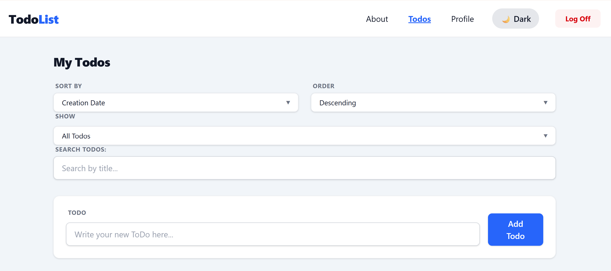
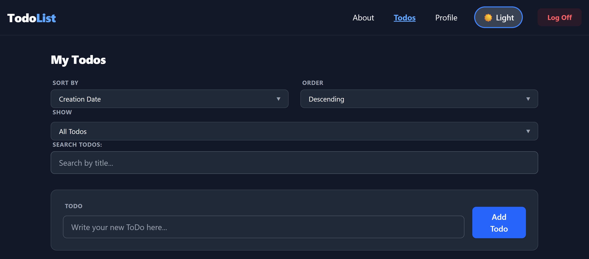
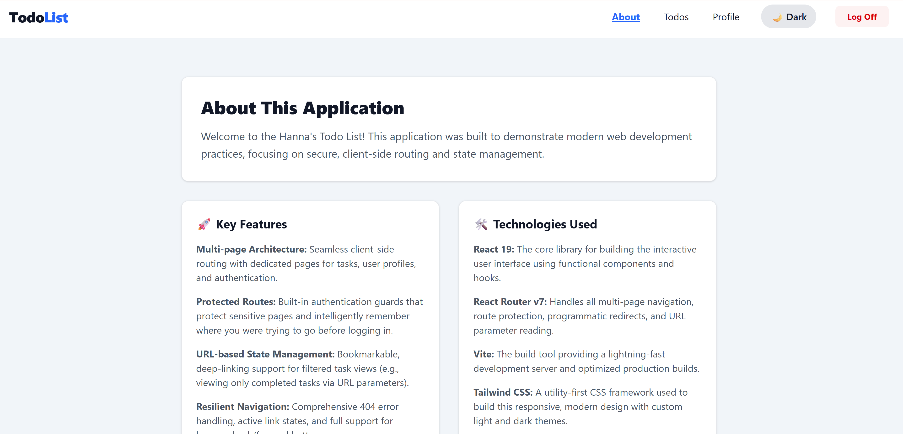
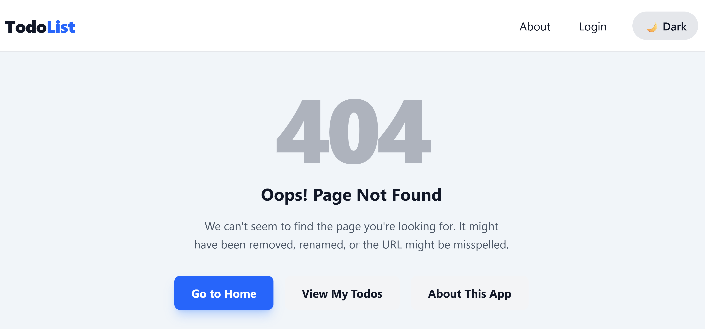
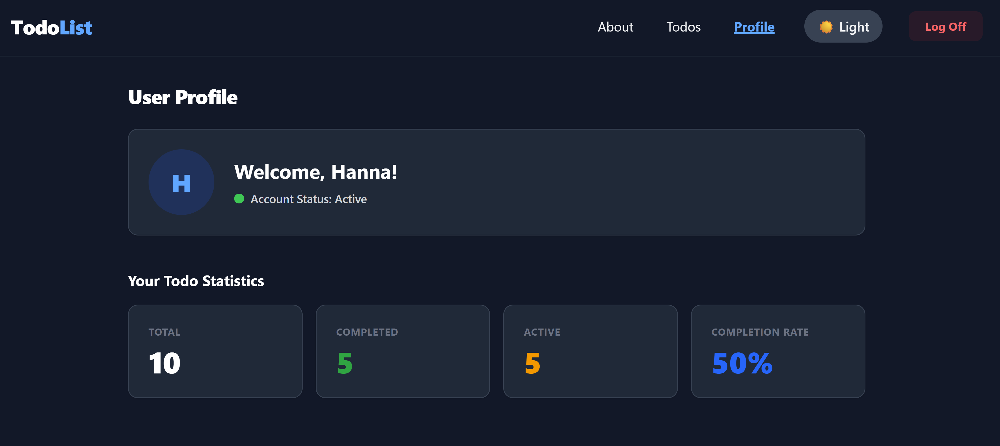
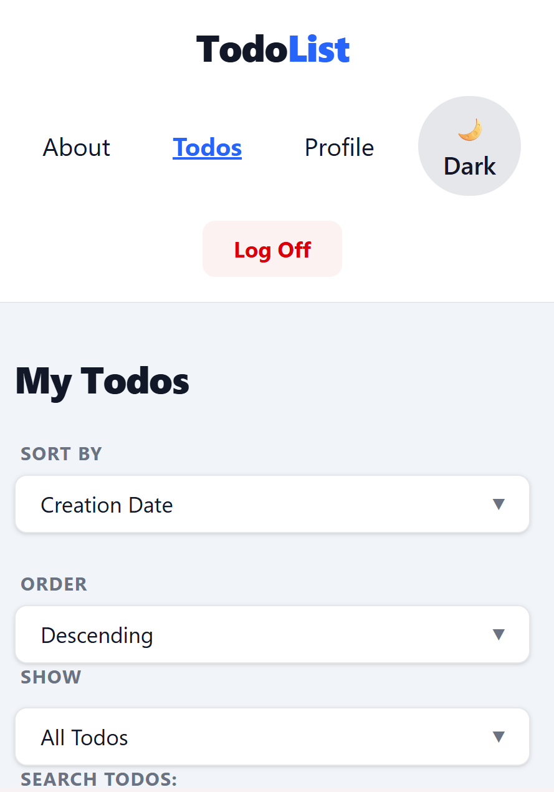
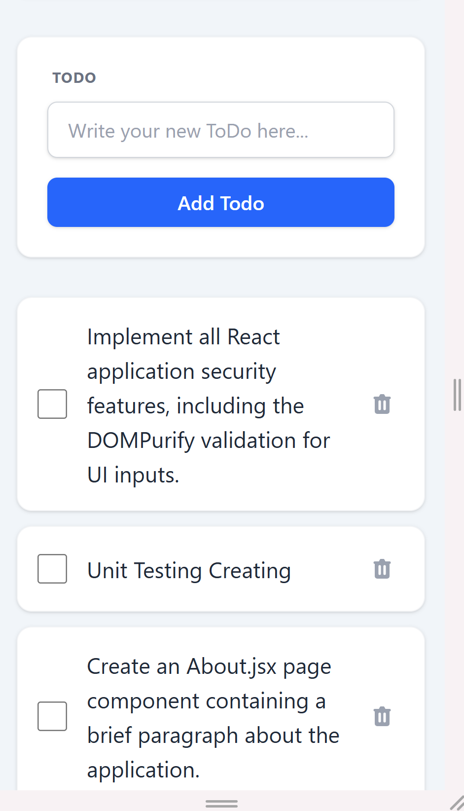
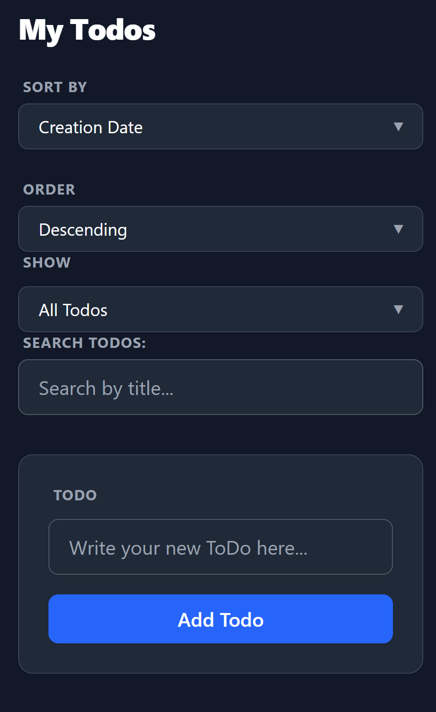
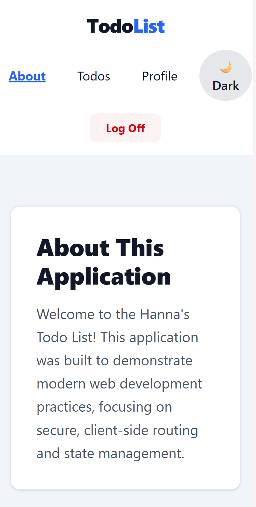
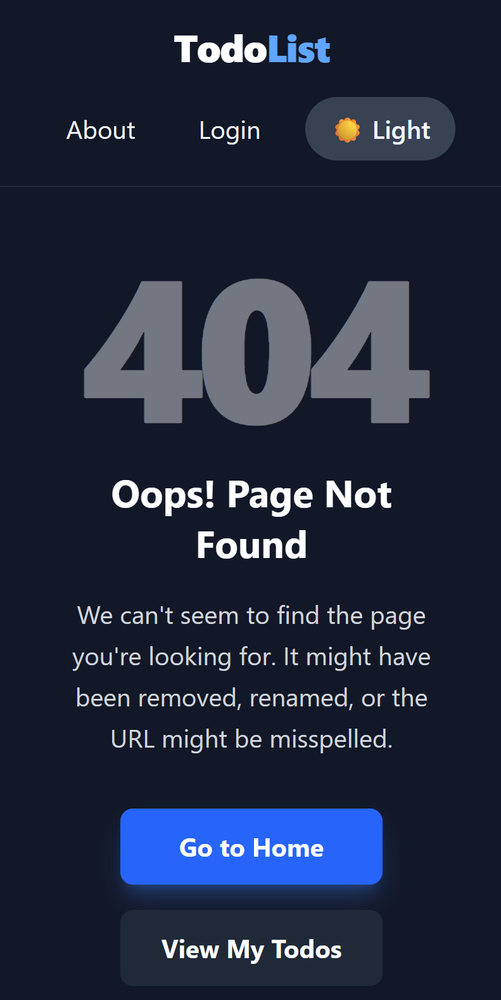

# About project
Name: TodoList
An app to manage personal daily routine tasks, allowing users to add, view, update, delete, and track todos locally.
The Purpose of the project: Helps users organize their daily tasks and keep track of what’s done or pending.

## 🚀 Live Demo
[Insert Link to Deployed Application Here]

## ✨ Key Features
* **Authentication & Protected Routes:** Secure login flow that restricts access to the main application and user profile.
* **Full CRUD Functionality:** Seamlessly create, read, update, and delete tasks.
* **Smart Filtering & Sorting:** Filter tasks by status (Active/Completed) and sort by Creation Date or Title.
* **Security First:** Implemented strict client-side validation and XSS protection using DOMPurify.
* **Modern UI/UX:** A card-based, responsive design with full Light/Dark mode support built entirely with Tailwind CSS.
* **Resilient Navigation:** Custom 404 error handling and deep-linking support via URL parameters.

## 🛠️ Technologies Used
* **React 19:** Functional components and hooks for building the interactive UI.
* **React Router v7:** Handles multi-page navigation, programmatic redirects, and route guards.
* **Vite:** Lightning-fast build tool and development server.
* **Tailwind CSS:** Utility-first framework for responsive, custom styling.
* **DOMPurify:** Security library to sanitize user inputs and prevent Cross-Site Scripting (XSS).

## 📸 Screenshots

### Desktop View

### Mobile View

## 🏁 Getting Started

### Prerequisites
Make sure you have [Node.js](https://nodejs.org/) installed on your machine.

### Installation Instructions
1. Fork and clone locally: Fork this repository to your GitHub account https://github.com/AnnetKo-art/hanna-ko-todo-list, then clone your fork to your local machine.
2. Install dependencies: Run `npm install` to install all required packages.

### How to run the development server
1. Open your Terminal in Visual Studio Code.
2. Start the development server with the command: `npm run dev`
3. Open a browser and navigate to http://localhost:3001

## 📜 Available Scripts

In the project directory, you can run:

* **`npm run dev`**: Starts the Vite development server. Open **http://localhost:3001** to view it in the browser.
* **`npm run build`**: Bundles the app into static files for production in the `dist` folder.
* **`npm run preview`**: Boots up a local static web server that serves the files from `dist` so you can test the production build locally.

## 🎨 Design Decisions

The application was styled using a utility-first approach with Tailwind CSS to ensure a highly maintainable and responsive design system.

* **Layout:** A centered, card-based architecture was chosen to give the application a premium, modern SaaS feel.
* **Typography & Hierarchy:** Standardized uppercase labels with wide tracking were used to separate UI controls from user-generated content clearly.
* **Accessibility:** High-contrast error states and dynamic color shifting (Light/Dark mode) were implemented to ensure the application is readable in any environment.

## 🔮 Future Improvements

If given more time, I plan to implement the following features:

* Drag-and-drop task reordering.
* Due dates and calendar integration.
* User-customizable categories/tags with color coding.

## 📄 License

This project is licensed under the MIT License.

## 📬 Contact Information

**Hanna Kovalenko**
* GitHub: [@AnnetKo-art](https://github.com/AnnetKo-art)

📖 PORTFOLIO NARRATIVE & DEVELOPER JOURNEY
🛠️ Technologies Learned and Applied
Throughout the development of this application, I transitioned from basic JavaScript logic to building a fully scalable React architecture. I mastered core React hooks (useState, useEffect) before advancing to complex state management using useReducer. To optimize rendering performance for list filtering, I integrated useMemo and useCallback. I implemented React Router for seamless multi-page navigation and protected routes. Furthermore, I prioritized application security by integrating DOMPurify to actively prevent Cross-Site Scripting (XSS) attacks. Finally, I modernized the application's UI by integrating Tailwind CSS for responsive, utility-first styling, all bundled efficiently using the Vite build system.

✨ Features and Functionality Highlights
Comprehensive Task Management: Users can seamlessly add, edit, toggle completion, and delete tasks using controlled forms with active validation.

XSS Security & Input Sanitization: Protected the application against Cross-Site Scripting (XSS) vulnerabilities by implementing DOMPurify, ensuring all user-generated task inputs and text are strictly sanitized before rendering in the browser.

Multi-Page Routing & Authentication Guards: Built a robust navigation flow utilizing React Router, featuring dedicated pages (Home, Todos, Profile, About), a custom 404 Error page, and protected routes requiring authentication to access sensitive data.

Dynamic Filtering & Sorting: Implemented high-performance URL-based state management that allows users to filter tasks by status and sort by creation date without losing their place on page reload.

Responsive, Themed UI: Engineered a mobile-first layout utilizing Tailwind CSS, complete with cross-platform responsive design and a fully integrated Dark/Light mode toggle.

🚀 My Role and Contributions
As the sole developer on this project, I was responsible for all architectural decisions, component design, and feature implementation. I independently mapped out the component hierarchy and established a scalable file structure separating features, shared components, hooks, and utilities. By taking ownership of both the logical state flow and the visual Tailwind CSS design, I ensured a cohesive and professional user experience from start to finish.

🧩 Challenges Faced and Solutions Implemented
The Reducer Architecture Shift: Transitioning from local state to a centralized useReducer architecture was my most significant technical challenge. As the app grew to include filtering, sorting, and API requests, standard useState hooks became difficult to trace. I had to fundamentally shift my mental model to separate "events" from "state updates" by dispatching specific action objects with precise payloads. Mastering this allowed me to implement optimistic UI updates, ensuring the UI reacts instantly while safely rolling back state if an API error occurs.

Connecting Complex Component Trees: Early in development, passing data between nested components—such as sending input from a Search Filter down into the Todo List and up to the main Page container—resulted in heavy "prop-drilling." I overcame this by stepping back, mapping out the data flow on paper, and restructuring my component hierarchy to lift state to the appropriate parent levels. This dramatically cleaned up the codebase and decoupled my presentation components from my business logic.

🔮 Future Enhancement Ideas
While the core functionality is solid, I plan to continue scaling this application by implementing the following features:

Drag-and-drop task reordering: To provide a more tactile and customizable user experience.

Due dates and calendar integration: Allowing users to sync tasks with external calendars and receive deadline notifications.

User-customizable categories: Adding custom tags and color-coding logic to help users visually organize distinct projects.